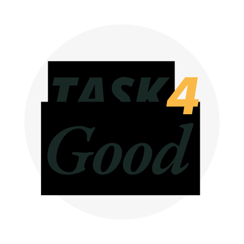

# Task4Good

---

The React Native exam project for the Start2Impact University - A simple To-Do List Project 📋

[Repository](https://github.com/BrianAtzori/task4good/) · [Report Bug](https://github.com/BrianAtzori/task4good/issues) · [Request Feature](https://github.com/BrianAtzori/task4good/issues)

## ABOUT THE PROJECT 🧶

### The exam track

_"In this project, we will need to create a task management app, which allows us to note down what we want to do and what we have done. The user will be able to choose two categories, between people and environment, when adding or completing a task._
- _API: Not necessary_
- _App Requirements:_
  - _Ability to add a new task by choosing between the two categories_
  - _Mark a task as completed_
  - _Filter tasks by category (person or environment) and status (to do, completed)_
  - _Create an organised and understandable app structure"_

### My work
Task4Good is a cross-platform local-first mobile app to organize and keep track of tasks.
The application is built with React Native and let you split personal tasks from what you wanna do for the environment.

In simple, you can:

- Create, edit, delete and visualize activities
- Read categories with a dedicated view for tasks of the same category
- Switch language
- Let your eyes rest with dark mode

## THESE PROJECT IS BUILD WITH 🏗️
- React Native
- Redux as state manager
- MMKV as Local DB
- UI Kitten

> You can test the application after cloning the repo and building the app for both iOS and Android

### CONTACTS

- 🤝🏻 My portfolio/Personal Website - https://www.brianatzori.it/

- 👽 Brian Atzori - <hello@brianatzori.it>

- 📖 Meet me @ https://linktr.ee/brianatzori
